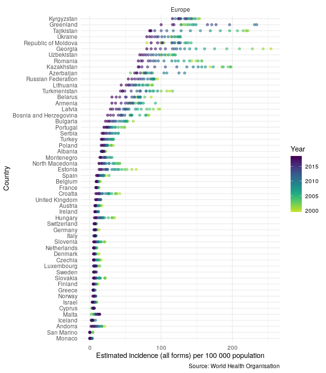

# Tüberküloz Verilerinin Harita Görselleştirmesi

## Takım Üyeleri

- Yunus Emre Gündoğmuş [@yemregundogmus](https://github.com/yemregundogmus)
- Feyza Zeynep Salam [@feyzazeynep](https://github.com/feyzazeynep)
- Emircan Sarıtaş [@emircansaritas](https://github.com/emircansaritas)
- Zehra Karadağ [@zehrakaradag](https://github.com/zehrakaradag)
- Kübra Kurt [@kubrakurt](https://github.com/kubrakurt)

## Kullanım

### Proje Amaçları
- R ile tüberküloz verisinin hazırlanması ve dünya üzerindeki yoğunluk haritasının ortaya konulması.

### Kazanımlar
- Tüberküloz verisinin detaylı analizi ve Tüberküloz hakkında farkındalık kazandırılması
- İnteraktif görselleştirme yetkinliği

### Gerekli Kütüphaneler
 
- plotly
- getTBinR

### Kullanımlar
#### Verinin Okunması ve Hazırlanması: 
``` R
library(plotly)
data <- read.csv("TB_burden_countries_2019-12-23.csv")
data2018<-data[which(data$year==2018), ]
```

#### İlk Grafiğin Çizdirilmesi
``` R
library(plotly)

# light grey boundaries
l <- list(color = toRGB("grey"), width = 0.5)

# specify map projection/options
g <- list(
  showframe = FALSE,
  showcoastlines = FALSE,
  projection = list(type = 'Mercator')
)

p <- plot_geo(data2018) %>%
  add_trace(
    z = ~e_pop_num, color = ~e_pop_num, colorscale = 'Viridis',
    text = ~country, locations = ~iso3, marker = list(line = l)
  ) %>%
  colorbar(title = 'Population', tickprefix = '') %>%
  layout(
    title = '2019 Tuberculosis (TB)<br>Source:<a href="https://www.who.int/tb/country/data/download/en/">World Health Organization</a>',
    geo = g
  )

p
```

#### getTBinR Kütüphanesi ile Görselleştirme

``` R
getTBinR::plot_tb_burden_overview(metric = "e_inc_100k",
                                  countries = "United Kingdom",
                                  compare_to_region = TRUE,
                                  interactive = FALSE)
#> Loading data from: /tmp/RtmpkjkDp6/tb_burden.rds
#> Loading data from: /tmp/RtmpkjkDp6/mdr_tb.rds
#> Joining TB burden data and MDR TB data.
#> Loading data from: /tmp/RtmpkjkDp6/dictionary.rds
#> 1 results found for your variable search for e_inc_100k
```
<!-- -->


### Referanslar

- [World Health Organization](https://www.who.int/tb/country/data/download/en/)
- [Plotly](https://plot.ly)
- [getTBinR](https://github.com/seabbs/getTBinR)
- [Tüberküloz (Verem Hastalığı) nedir? Belirtileri ve tedavi yöntemleri](https://www.medicalpark.com.tr/tuberkuloz-nedir-belirtileri-teshisi-ve-tedavi-yontemleri-nelerdir/hg-1772)


